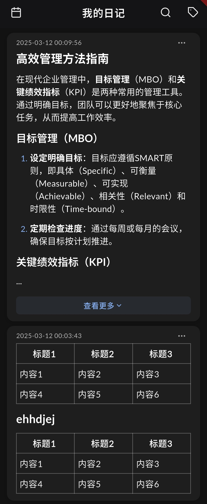

<div align="center">

# 📚 Daily Satori

**本地优先的智能知识管理工具**

快速收集 · AI 整理 · 智能搜索 · 知识沉淀

[](LICENSE)
[](https://flutter.dev/)
[](https://github.com/SatoriTours/Daily/releases)
[](https://github.com/SatoriTours/Daily/pulls)

[功能特性](#-功能特性) · [快速开始](#-快速开始) · [更新日志](#-更新日志) · [参与贡献](#-参与贡献)

</div>

---

## 🎯 为什么选择 Daily Satori？

- 🔒 **隐私第一** - 所有数据本地存储，零云依赖(除自定义大模型外)
- 🤖 **AI 增强** - 智能摘要、搜索、总结，让信息流动起来
- 🚀 **现代体验** - Flutter 构建，流畅优雅的原生体验
- 🧩 **高度可扩展** - 插件机制、自定义提示词、多语言支持

## ✨ 功能特性

- 📝 **内容收集** - 分享导入、剪切板监控、智能解析网页
- 🔍 **全文搜索** - 毫秒级检索，支持标签和分类
- 🤖 **AI 智能助手** - 智能对话、语义搜索、自动总结
- ✍️ **日记** - 轻松记录、标签分类、快捷搜索
- 📚 **书籍管理** - 智能搜索、OpenLibrary 集成、AI 核心观点
- 📊 **周报总结** - 基于日记自动生成周报
- 📖 **阅读体验** - Markdown 渲染、深色模式、离线可用
- 🌐 **多端访问** - 局域网 Web 服务、数据备份
- 🧩 **插件扩展** - 自定义提示词、多语言支持

## 📸 界面预览

<table>
  <tr>
    <td align="center"><b>首页</b></td>
    <td align="center"><b>文章详情</b></td>
    <td align="center"><b>AI 助手</b></td>
    <td align="center"><b>日记</b></td>
  </tr>
  <tr>
    <td></td>
    <td></td>
    <td></td>
    <td></td>
  </tr>
  <tr>
    <td align="center"><b>书籍管理</b></td>
    <td align="center"><b>周报总结</b></td>
  </tr>
  <tr>
    <td></td>
    <td></td>
  </tr>
</table>

## 🚀 快速开始

### 环境要求
```
Flutter SDK >= 3.0
Dart SDK >= 2.17
```

### 安装运行

```bash
# 克隆仓库
git clone https://github.com/SatoriTours/Daily.git
cd Daily

# 安装依赖
flutter pub get

# 代码生成
flutter pub run build_runner build --delete-conflicting-outputs

# 运行应用
flutter run
```

### 初始配置
1. 进入"设置"页面
2. （可选）配置 AI Key 和 API Base URL
3. 配置 Web 服务（端口和密码）
4. 开始使用！

> 💡 提示：未配置 AI 时仍可作为纯内容管理工具使用

## 🏗️ 技术栈

```
框架：Flutter + Riverpod + GoRouter
数据库：ObjectBox + SQLite
网络：Dio + 自定义解析流水线
AI：openai_dart
书籍搜索：OpenLibrary API + pinyin
Web 服务：shelf + WebSocket
样式：Material Design 3
其他：ADBlock 过滤、插件化架构、Riverpod 状态管理
```

## 📂 项目结构

```
lib/app/
├── components/     # 可复用组件
├── config/         # 配置文件
├── data/           # 数据层（模型+仓储）
├── pages/          # 页面模块
│   ├── home/       # 首页
│   ├── articles/   # 文章管理
│   ├── article_detail/  # 文章详情
│   ├── diary/      # 日记
│   ├── books/      # 书籍管理
│   ├── ai_chat/    # AI 助手
│   ├── ai_config/  # AI 配置
│   ├── share_dialog/   # 分享对话框
│   ├── settings/   # 设置
│   ├── backup_*/   # 备份相关
│   ├── plugin_center/  # 插件中心
│   └── weekly_summary/ # 周报总结
├── providers/      # 全局状态 Providers
├── routes/         # 路由配置
├── services/       # 全局服务
├── styles/         # 样式系统
└── utils/          # 工具类
```

## 📋 更新日志

### v3.6.85 (2026-01-04)

**🎨 界面优化**
- 优化文章详情页面处理效果
- 改进详情页动画过渡
- 简化文章页参数处理逻辑

**🔧 技术改进**
- 简化路由名称，统一 Routes 管理
- 优化代码结构和代码质量
- 去除对话框相关的 context 参数依赖
- 修正原生路由跳转问题，统一使用 go_router

### v3.6.83 (2025-12)

**🔧 功能改进**
- 优化日志输出
- 修复失败文章自动重新处理
- 优化路由代码

**✨ 新功能**
- 完成应用首次启动配置界面
- 完成首次使用设置引导功能

### v3.6.82 (2025-12)

**📚 书籍管理**
- 优化书籍搜索逻辑
- 优化书籍相关服务

**⚡ 性能优化**
- 优化页面性能
- 优化代码性能

[查看完整更新日志](https://github.com/SatoriTours/Daily/releases)

## 🤝 参与贡献

欢迎各种形式的贡献！

- 🐛 报告 Bug
- 💡 提出新功能建议
- 🔧 提交代码改进
- 📝 完善文档

提交 PR 前请：
1. 阅读 [编码规范](./docs/01-coding-standards.md)
2. 运行 `flutter analyze` 检查代码
3. 运行 `dart format .` 格式化代码

## ❓ 常见问题

**数据会上传云端吗？**
不会。所有数据存储在本地，仅在配置 AI 时调用外部 API。

**必须配置 AI 吗？**
不是必须的。未配置时可作为纯内容收集工具使用, 但很多功能用不了。

**支持哪些 AI 模型？**
支持所有兼容 OpenAI API 的模型和服务。

**如何添加新语言？**
修改 `assets/i18n/` 目录下的配置文件即可。

## 🔒 隐私声明

- ✅ 本地优先 - 数据存储在设备本地
- ✅ 无云依赖 - 不依赖任何云服务
- ✅ 可选 AI - AI 功能仅在配置后启用
- ✅ 零追踪 - 不收集任何用户行为数据

## 📄 开源协议

[MIT License](LICENSE)

## 🔗 相关链接

- 📦 [发行版本](https://github.com/SatoriTours/Daily/releases)
- 🐛 [问题反馈](https://github.com/SatoriTours/Daily/issues)
- 💬 [讨论交流](https://github.com/SatoriTours/Daily/discussions)
- 🧩 [插件示例](https://github.com/SatoriTours/plugin)

---

<div align="center">

**让信息收集更轻松，知识沉淀更高效**

Made with ❤️ by [SatoriTours](https://github.com/SatoriTours)

⭐ 如果这个项目对你有帮助，请给个 Star 支持一下！

</div>
