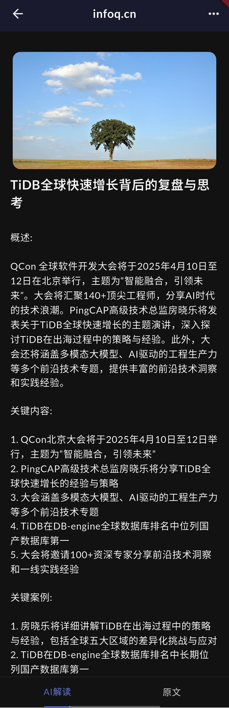

# Daily Satori

app的愿景是能成为帮助个人学习和修炼的助手, 目前仅支持文章收藏功能.

## 特点

1. 不依赖服务器, 本地优先(如果要启用AI总结, 需要用到openai的api), 所以整个app速度非常快.
2. 文章列表和搜索: 这个没什么好说的,就是能看和搜索自己收藏的内容.
3. 文章收藏: 会获取网页的截图, 网站里面的主要图片, 主要内容并通过AI分析.
4. AI解读: 默认会先看AI总结的内容.
5. 文章截图: 保存网页截图本地, 当做飞机或者网络不好的时候也能随时查看.

## 功能截图

  
  
  
  

## 下载和安装

1. 可以在 [这里下载最新版本](https://github.com/SatoriTours/Daily/releases/latest).
2. APP里面也会自动检测和更新, 或者到设置里面手动点击更新.
