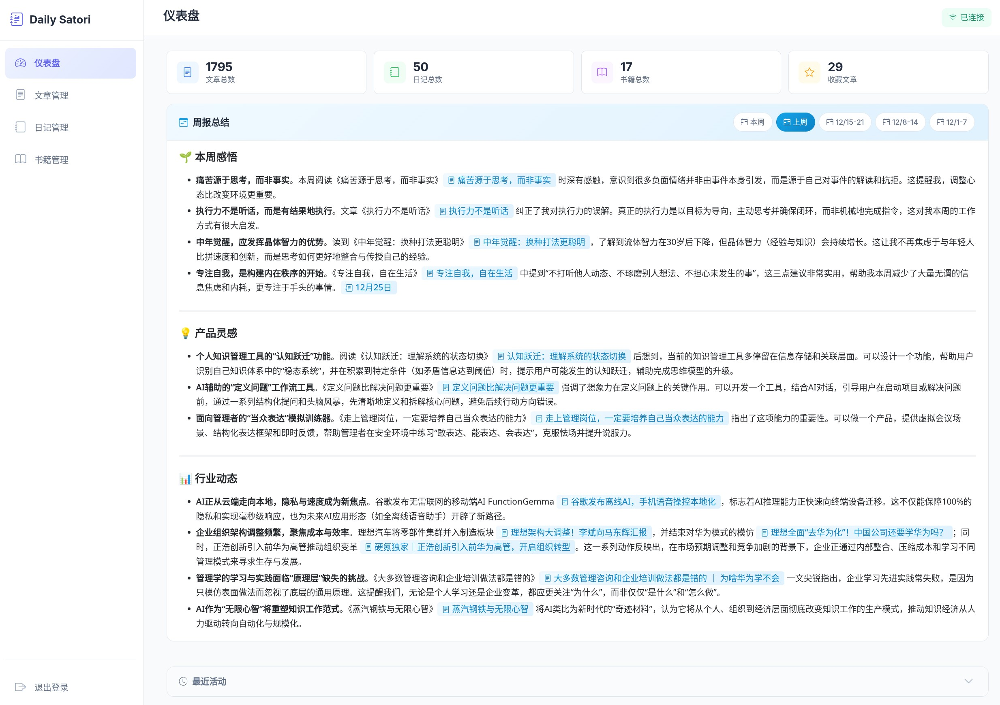
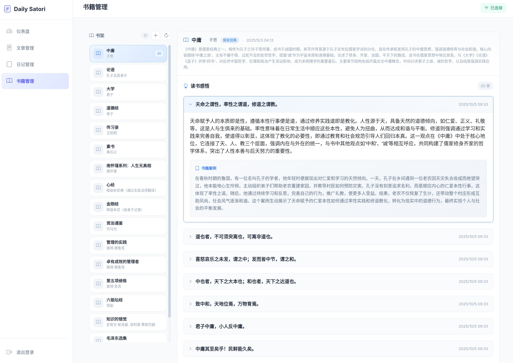

<div align="center">

# Daily Satori

**把每天读到、想到、收藏到的内容，慢慢沉淀成自己的知识系统。**

本地优先 · 可接入 AI 整理 · 文章 / 日记 / 读书 / 新闻 / 助手

[](LICENSE)
[](https://github.com/SatoriTours/Daily/releases)

[下载使用](https://github.com/SatoriTours/Daily/releases) · [问题反馈](https://github.com/SatoriTours/Daily/issues) · [讨论交流](https://github.com/SatoriTours/Daily/discussions)

</div>

---

## 为什么做

每天的信息很多：文章、新闻、书摘、灵感、收藏、对话、日记。它们常常散在不同应用里，看过就过去了，真正能留下来的东西很少。

Daily Satori 想做的是一个更安静的个人知识入口：先把内容收进来，再用 AI 帮你整理、提炼、关联，最后回到阅读、写作和思考本身。

它不是一个追求社交、推荐流和云端同步的产品。它更像一个放在手机里的个人资料库，默认本地保存，由你自己决定接入哪些 AI 服务、导入哪些内容、沉淀哪些想法。

## 核心思路

- **本地优先**：数据默认保存在设备本地，先保证自己的内容自己可控。
- **少一点信息流，多一点沉淀**：不是让你刷更多，而是让内容更容易被整理、回看和复用。
- **AI 是整理助手，不是内容主人**：AI 用来提炼摘要、生成观点、辅助检索和陪你追问，但最终判断仍然属于你。
- **从日常入口开始**：文章、日记、读书、新闻和收藏都可以进入同一个系统，逐渐形成个人记忆。

## 现在能做什么

### 文章

- 从系统分享入口保存网页链接。
- 自动提取正文、封面图和可读内容。
- 用 AI 生成摘要、标签、分类和 Markdown 阅读内容。
- 文章详情可以沉浸阅读，也可以被 AI 助手引用和追问。

### 新闻

- 聚合本地文章、远程新闻源和每日新闻汇总。
- 支持统一整理后的今日简报，也能回到不同来源继续阅读。
- 新闻卡片更偏杂志阅读体验，减少信息噪音。
- 适合把“今天值得看的内容”先整理成一份可读清单。

### 日记

- 记录文字、图片、心情和标签。
- 支持更轻量的日记卡片阅读与编辑体验。
- 可以生成周报，让一周的生活和想法被重新整理。
- 日记内容也可以成为 AI 助手回答时的本地记忆来源。

### 读书

- 添加书籍并生成核心观点卡片。
- 内置微信读书 Skill，可基于书籍资料提炼观点、案例和思考方向。
- 阅读页以单本书为中心，横向滑动阅读观点。
- 支持“想一想”：围绕当前观点继续追问、记录反思，并查看历史与已沉淀内容。

### 收藏同步

- 支持连接外部收藏来源，目前包含 X 收藏相关能力。
- 可以定期同步收藏内容，把外部平台里的信息带回本地。
- 同步后的内容可以继续进入文章整理、AI 处理和本地检索流程。

### AI 助手

- 可以基于本地文章、日记、书籍观点等内容回答问题。
- 回答会带引用来源，方便回到原文、日记或读书观点继续查看。
- 支持持续对话，把分散内容串成可以追问的个人记忆。
- 适合问：“我最近都在关注什么？”、“这本书里哪些观点和我的日记有关？”、“帮我找以前收藏过的某类内容。”

### 设置与扩展

- 可配置自己的 AI 模型服务。
- 可管理外部工具服务，让 AI 助手拥有更多检索和处理能力。
- 可管理 Skills，例如微信读书能力。
- 支持插件服务器配置，为后续扩展预留入口。
- 支持备份、恢复、旧数据导入和本地 Web 访问。

## 界面预览

<table>
  <tr>
    <td align="center"><b>首页</b></td>
    <td align="center"><b>文章详情</b></td>
    <td align="center"><b>AI 助手</b></td>
    <td align="center"><b>日记</b></td>
  </tr>
  <tr>
    <td></td>
    <td></td>
    <td></td>
    <td></td>
  </tr>
  <tr>
    <td align="center"><b>读书</b></td>
    <td align="center"><b>周报</b></td>
    <td align="center"><b>桌面访问</b></td>
    <td align="center"><b>书籍资料</b></td>
  </tr>
  <tr>
    <td></td>
    <td></td>
    <td></td>
    <td></td>
  </tr>
</table>

## 适合谁

- 想把网页、书摘、日记和收藏放在一起整理的人。
- 希望 AI 帮忙做摘要、提炼观点，但不想把全部数据交给一个云端服务的人。
- 喜欢本地优先、可备份、可迁移的个人工具。
- 想把“每天看过的东西”变成长期可检索、可回看的个人资料库。

## 隐私边界

- 数据默认保存在设备本地。
- 不内置强制云同步。
- AI 功能只有在你配置模型服务后才会调用外部服务。
- 外部收藏、微信读书、外部工具等能力都需要你主动配置。
- 请不要在 issue、日志或截图里公开 API Key、Token、数据库文件或备份密码。

## 使用方式

你可以从 [Releases](https://github.com/SatoriTours/Daily/releases) 下载 APK 安装。

第一次使用建议先做三件事：

1. 在设置里配置 AI 服务。
2. 通过系统分享保存几篇文章。
3. 写一篇日记或添加一本书，看看 AI 助手如何基于本地内容回答问题。

## 开发者入口

如果你想自己构建 APK：

```bash
./gradlew :app:assembleDebug
./gradlew :app:installDebug
```

发布版本时，tag 必须匹配 `app/build.gradle.kts` 的 `versionName`，例如 `versionName = "5.1.26"` 对应 tag `v5.1.26`。推送 `main` 和对应 tag 后，GitHub Actions 会构建 Release APK。

更详细的开发约束可以查看仓库里的 `CLAUDE.md`、`AGENTS.md` 和 `docs/`。

## 愿景

Daily Satori 的目标不是做另一个“信息入口”，而是做一个长期陪伴的个人知识底座。

它应该能接住你每天看到的内容，也能接住你每天想到的东西；既能帮你快速整理，也能在很久以后帮你重新找到某个想法的来处。

短期看，它是文章、日记、读书、新闻和 AI 助手。长期看，它希望成为一个由你自己拥有、自己控制、自己慢慢训练出来的个人记忆系统。

## 开源协议

[MIT License](LICENSE)

---

<div align="center">

**让信息回到自己手里，让想法有地方沉淀。**

Made by [SatoriTours](https://github.com/SatoriTours)

</div>
