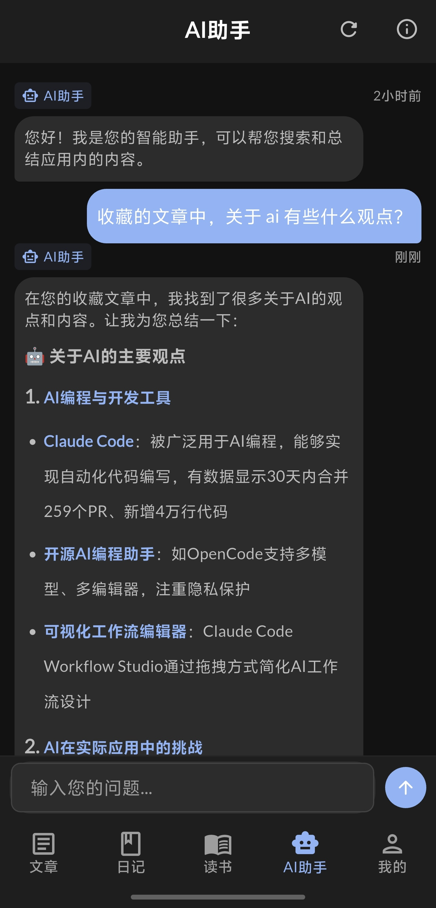
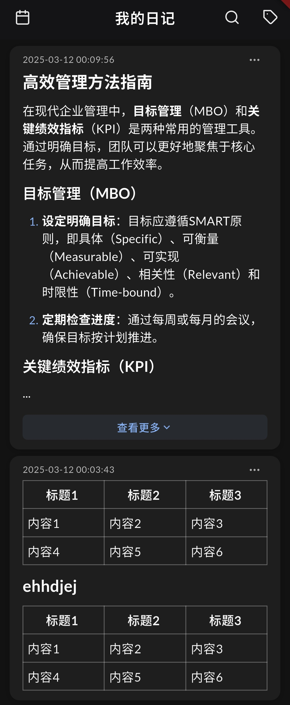

<div align="center">

# Daily Satori

**本地优先的智能知识管理 Android 应用**

快速收集 · AI 整理 · Markdown 阅读 · 局域网访问 · 知识沉淀

[](LICENSE)
[](https://kotlinlang.org/docs/multiplatform.html)
[](https://developer.android.com/)
[](https://github.com/SatoriTours/Daily/releases)
[](https://github.com/SatoriTours/Daily/actions/workflows/unit-tests.yml)

[功能特性](#功能特性) · [快速开始](#快速开始) · [项目结构](#项目结构) · [发布流程](#发布流程) · [贡献](#贡献)

</div>

---

## 项目简介

Daily Satori 是一个本地优先的 Android 知识管理工具，用于收集网页、整理文章、管理书籍与日记，并通过用户自配置的 AI 服务生成摘要和结构化内容。

项目当前主线是 Kotlin Multiplatform + Android 原生实现：共享业务逻辑位于 `shared/`，Android 应用位于 `app/`。以后 `main` 分支作为主要开发分支使用。

## 功能特性

- 内容收集：通过分享入口保存网页链接，并在后台解析网页正文。
- AI 处理：支持兼容 OpenAI API 的模型，用于摘要、Markdown 转换、标签和分类生成。
- 阅读体验：文章详情支持 Markdown 渲染、封面图、阅读进度和本地离线访问。
- 书籍管理：记录书籍信息、阅读状态和 AI 核心观点。
- 日记与周报：记录日常内容，并基于日记生成周期总结。
- 局域网服务：在同一网络下通过浏览器访问应用数据。
- 本地优先：数据存储在设备本地，AI 功能仅在用户配置后调用外部服务。

## 界面预览

<table>
  <tr>
    <td align="center"><b>首页</b></td>
    <td align="center"><b>文章详情</b></td>
    <td align="center"><b>AI 助手</b></td>
    <td align="center"><b>日记</b></td>
  </tr>
  <tr>
    <td></td>
    <td></td>
    <td></td>
    <td></td>
  </tr>
  <tr>
    <td align="center"><b>书籍管理</b></td>
    <td align="center"><b>周报总结</b></td>
  </tr>
  <tr>
    <td></td>
    <td></td>
  </tr>
</table>

## 快速开始

### 环境要求

- JDK 21
- Android SDK，包含项目使用的 `compileSdk = 36`
- Gradle Wrapper，使用仓库内的 `./gradlew`

### 构建与运行

```bash
# 克隆仓库
git clone https://github.com/SatoriTours/Daily.git
cd Daily

# 编译检查
./gradlew :app:compileDebugKotlin

# 构建 Debug APK
./gradlew :app:assembleDebug

# 安装到已连接的 Android 设备
./gradlew :app:installDebug
```

### 启动应用

```bash
adb shell am start -n com.dailysatori/.MainActivity
```

## 技术栈

- Kotlin Multiplatform：共享配置、服务、仓储和数据库逻辑。
- Android + Compose Multiplatform：Android UI 与应用入口。
- SQLDelight：本地数据库 Schema 和类型安全查询。
- Koin：依赖注入和 ViewModel 装配。
- WorkManager：后台文章处理和恢复任务。
- Ktor：局域网 Web 服务。
- Jsoup：网页内容解析。
- Kermit：跨平台日志。

## 项目结构

```text
shared/
├── commonMain/kotlin/com/dailysatori/
│   ├── config/             # 配置常量
│   ├── data/repository/    # 数据仓储
│   ├── platform/           # expect 平台接口
│   └── service/            # AI、解析、迁移等共享服务
└── commonMain/sqldelight/  # SQLDelight 数据库 Schema

app/src/main/kotlin/com/dailysatori/
├── core/di/                # Koin 模块
├── core/navigation/        # Compose Navigation
├── core/worker/            # WorkManager 后台任务
└── ui/
    ├── component/          # 可复用组件
    ├── feature/            # 功能页面
    └── theme/              # 颜色、间距、字体等样式系统
```

## 开发规范

- 样式必须使用 `com.dailysatori.ui.theme.*`，避免硬编码颜色、间距和字体。
- 修改数据库 Schema 时必须同步增加迁移逻辑。
- 修改代码后至少运行 `./gradlew :app:compileDebugKotlin`。
- 发布前建议运行 `./gradlew test`。

更多约束见 `CLAUDE.md` 和 `docs/` 目录。

## 发布流程

GitHub Actions 会在推送 `v*.*.*` tag 时构建签名 Release APK，并上传到 GitHub Release。

发布条件：tag 指向的 commit 必须属于 `main` 分支历史。签名使用仓库 GitHub Secrets：

- `KEY_JKS`：base64 编码后的 keystore
- `KEY_ALIAS`：签名 alias
- `KEY_PASSWORD`：key 密码
- `STORE_PASSWORD`：keystore 密码

示例：

```bash
git checkout main
git pull
git tag v1.2.3
git push origin main v1.2.3
```

## 贡献

提交改动前请运行：

```bash
./gradlew :app:compileDebugKotlin
```

如果改动影响共享逻辑或数据库，请同时运行相关单元测试或完整测试：

```bash
./gradlew test
```

## 隐私说明

- 数据默认保存在设备本地。
- 不内置强制云同步。
- AI 功能仅在用户配置 API 后调用外部模型服务。
- 请勿在日志或 issue 中提交 API Key、数据库文件或 keystore。

## 开源协议

[MIT License](LICENSE)

## 相关链接

- [发行版本](https://github.com/SatoriTours/Daily/releases)
- [问题反馈](https://github.com/SatoriTours/Daily/issues)
- [讨论交流](https://github.com/SatoriTours/Daily/discussions)

---

<div align="center">

**让信息收集更轻松，知识沉淀更高效**

Made by [SatoriTours](https://github.com/SatoriTours)

</div>
