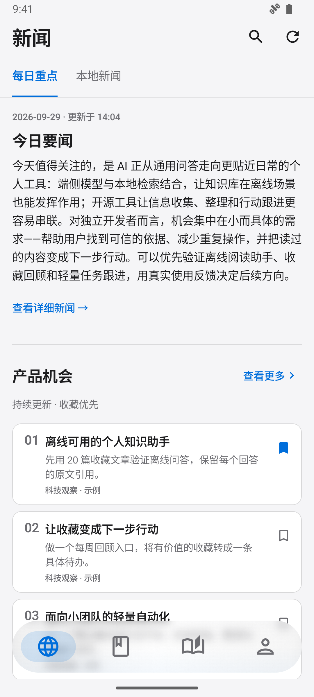
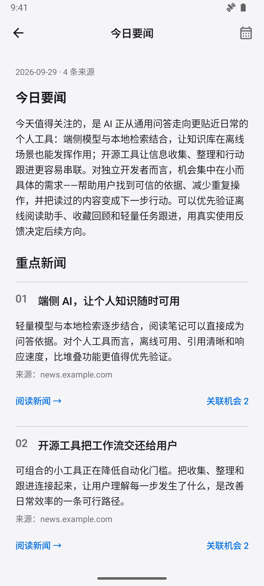
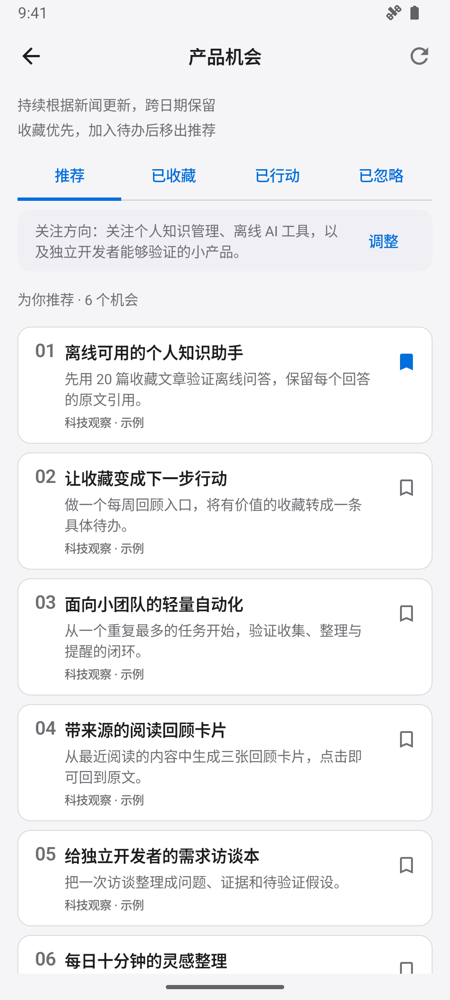
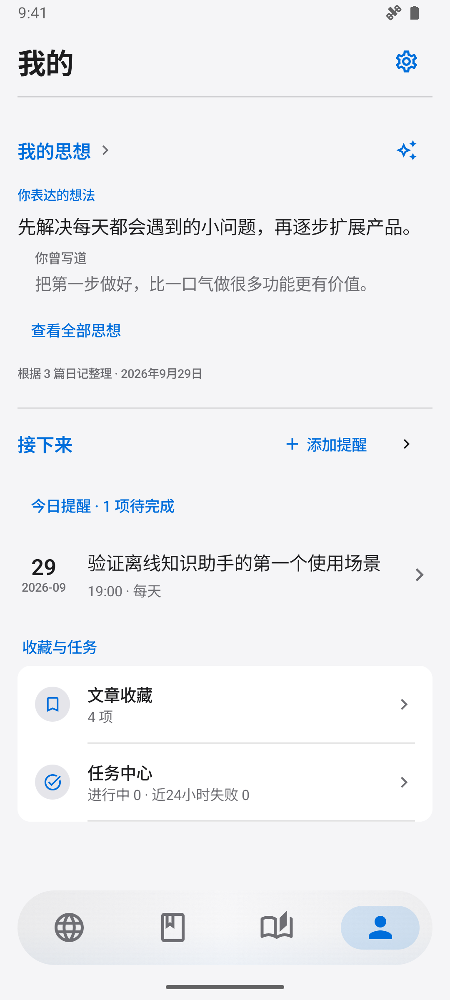
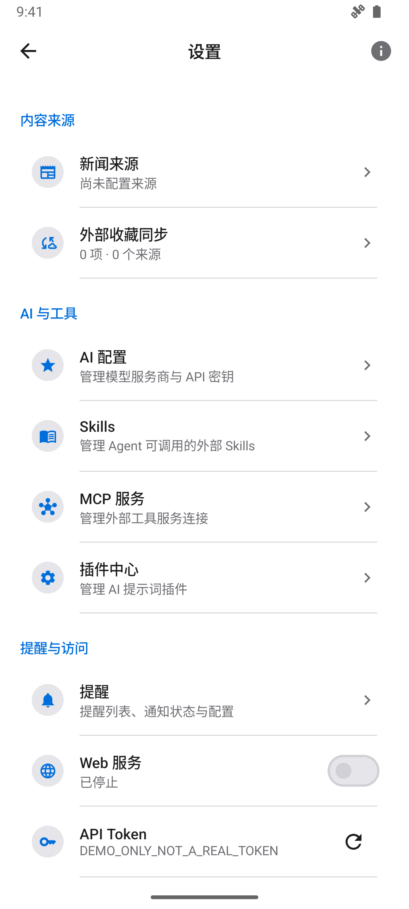
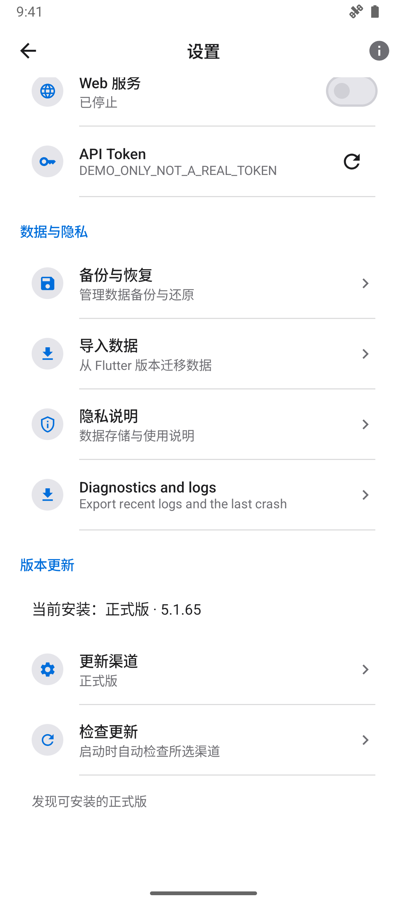
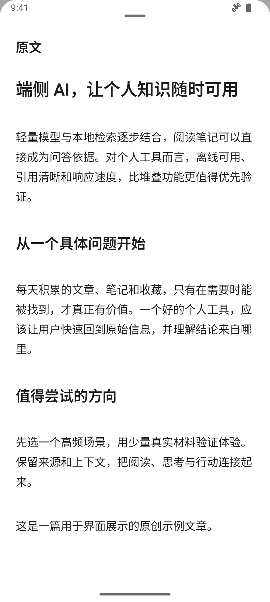
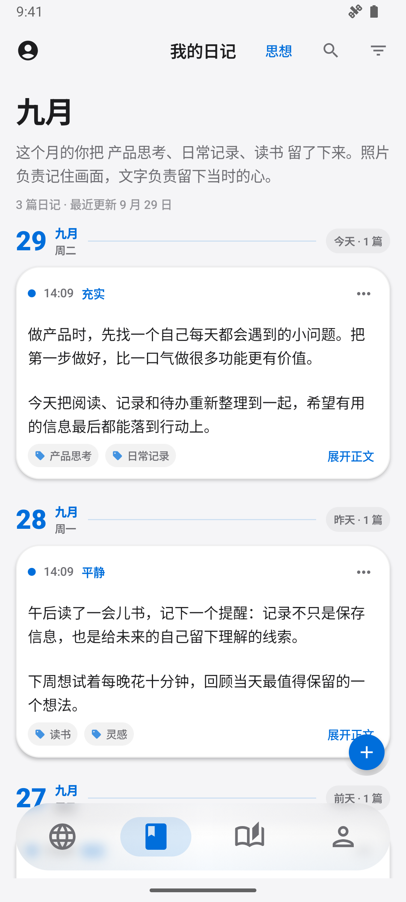
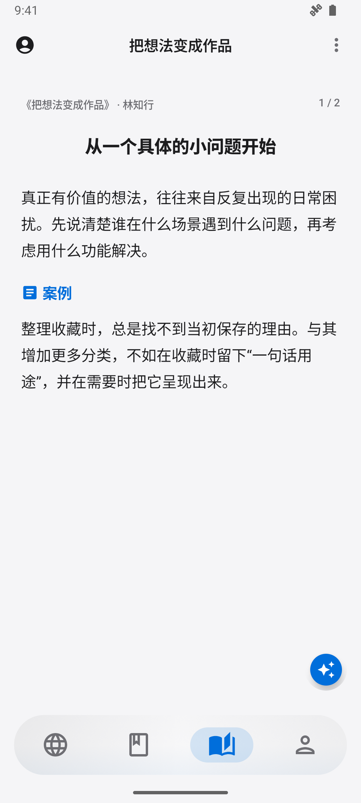

<div align="center">

# Daily Satori

**读懂每天的信息，沉淀自己的想法，把有价值的发现变成行动。**

本地优先 · AI 辅助整理 · 每日重点 / 产品机会 / 日记 / 读书 / 待办

[](LICENSE)
[](https://github.com/SatoriTours/Daily/releases)

[下载使用](https://github.com/SatoriTours/Daily/releases) · [问题反馈](https://github.com/SatoriTours/Daily/issues) · [讨论交流](https://github.com/SatoriTours/Daily/discussions)

</div>

---

## 为什么做

每天的信息很多：文章、新闻、书摘、灵感、收藏、对话、日记。它们常常散在不同应用里，看过就过去了，真正能留下来的东西很少。

Daily Satori 是一个本地优先的个人知识与行动工具：收集文章和收藏，用 AI 整理新闻、日记和读书观点，再结合你的关注方向，从新闻中发现值得继续探索的产品机会。

内容默认保存在手机里。你可以决定接入哪些 AI 服务、订阅哪些新闻来源、同步哪些收藏，并把有用的发现加入待办，继续跟进。

## 核心思路

- **本地优先**：数据默认保存在设备本地，先保证自己的内容自己可控。
- **少一点信息流，多一点沉淀**：不是让你刷更多，而是让内容更容易被整理、回看和复用。
- **AI 是整理助手，不是内容主人**：AI 用来提炼摘要、生成观点、辅助检索和陪你追问，但最终判断仍然属于你。
- **从日常入口开始**：文章、日记、读书、新闻和收藏都可以进入同一个系统，逐渐形成个人记忆。

## 现在能做什么

底部导航分为四个入口：

| 入口 | 主要内容 |
|------|----------|
| 今日（新闻） | 每日重点、今日要闻、产品机会及各来源新闻 |
| 日记 | 日常记录、图片、心情、标签和周报 |
| 读书 | 书籍、核心观点、案例和反思 |
| 我的 | 思想、待办、文章收藏和任务中心；右上角齿轮进入设置 |

以下功能说明以当前源码为准，已发布 APK 可能有所差异。

### 新闻与每日重点

- 汇集本地文章与远程新闻，首个标签页是**每日重点**。
- **今日要闻**用一段连贯的文字梳理重要动态，点入详情可查看具体新闻及来源。
- **产品机会**结合新闻与你的思想或关注方向，提炼值得验证的产品切入点，并提供新闻依据。
- 每日重点中的两部分可以连续向下浏览；产品机会展示前 **5** 项，更多内容进入机会列表查看。
- 机会跨日期保留，按相关性、可执行性和时效性持续排序，首页展示排名靠前的机会。
- **收藏即优先展示**，统一使用收藏按钮。加入待办后，机会从首页推荐中移出，可在机会列表的相应筛选中回看。
- 也可以切换新闻来源，继续阅读和搜索具体文章。

### 文章

- 从系统分享入口保存网页链接。
- 自动提取正文、封面图和可读内容。
- 用 AI 生成摘要、关键观点、标签和分类。
- 文章详情区分 AI 整理内容与原文，并显示获取文章的来源。
- 原文以实际获取到的正文为准；来源只提供摘要或正文抓取失败时，无法在应用内展示完整原文，可继续访问原始链接。
- 支持收藏与沉浸阅读，也可以被 AI 助手引用和追问。

### 日记

- 记录文字、图片、心情和标签。
- 支持更轻量的日记卡片阅读与编辑体验。
- 可以生成周报，让一周的生活和想法被重新整理。
- 日记内容也可以成为 AI 助手回答时的本地记忆来源。

### 读书

- 添加书籍并生成核心观点卡片。
- 内置微信读书 Skill，可基于书籍资料提炼观点、案例和思考方向。
- 阅读页以单本书为中心，横向滑动阅读观点。
- 支持“想一想”：围绕当前观点继续追问、记录反思，并查看历史与已沉淀内容。

### 收藏同步

- 支持连接外部收藏来源，目前包含 X 收藏与 GitHub Stars。
- 可以定期同步收藏内容，把外部平台里的信息带回本地。
- GitHub Stars 会保存仓库简介、语言、主题和 README，再由 AI 整理并纳入本地搜索。
- 同步后的内容可以继续进入文章整理、AI 处理和本地检索流程。

### AI 助手

- 可以基于本地文章、日记、书籍观点等内容回答问题。
- 回答会带引用来源，方便回到原文、日记或读书观点继续查看。
- 支持持续对话，把分散内容串成可以追问的个人记忆。
- 适合问：“我最近都在关注什么？”、“这本书里哪些观点和我的日记有关？”、“帮我找以前收藏过的某类内容。”

### 我的：思想与行动

- **思想**：从日记中整理个人观点，保留支撑观点的原始记录，方便回看和继续讨论。
- **待办**：查看今日待办和近期提醒，支持新增待办及重复提醒，也能承接产品机会的后续行动。
- **文章收藏**：直接进入收藏文章列表。
- **任务中心**：查看同步与处理任务、进度和失败情况，并可直接查看近期失败任务。

### 设置与扩展

从**我的 → 右上角齿轮**直接进入设置。配置项在同一页按五组展示，点击条目即可进入对应配置，返回时保留列表位置。

| 分组 | 配置内容 |
|------|----------|
| 内容来源 | 新闻来源、外部收藏同步（X 收藏、GitHub Stars） |
| AI 与工具 | AI 模型与 API 密钥、Skills、MCP 服务、提示词插件 |
| 提醒与访问 | 提醒设置、本地 Web 服务与访问 Token |
| 数据与隐私 | 备份与恢复、旧版数据导入、隐私说明、诊断 |
| 版本更新 | 更新渠道、检查更新及当前版本信息 |

来源、模型等具体条目保留必要的编辑页；备份恢复保留独立操作步骤。

## 界面预览

以下为当前 Android 应用在模拟器中的实际截图，使用虚构演示内容与占位配置。截图保留完整的 **1080 × 2400** 手机画幅，点击可查看原图；设置页分为上下两屏展示。

| 每日重点 | 今日要闻详情 | 产品机会 |
|:---:|:---:|:---:|
| [](docs/images/home.png) | [](docs/images/news_headlines.png) | [](docs/images/opportunities.png) |

| 我的 | 设置：来源与工具 | 设置：数据与更新 |
|:---:|:---:|:---:|
| [](docs/images/my_space.png) | [](docs/images/settings.png) | [](docs/images/settings_more.png) |

| 文章原文 | 日记 | 读书观点 |
|:---:|:---:|:---:|
| [](docs/images/article_detail.png) | [](docs/images/diary.png) | [](docs/images/books.png) |

## 适合谁

- 想把网页、书摘、日记和收藏放在一起整理的人。
- 希望 AI 帮忙做摘要、提炼观点，但不想把全部数据交给一个云端服务的人。
- 喜欢本地优先、可备份、可迁移的个人工具。
- 想把“每天看过的东西”变成长期可检索、可回看的个人资料库。
- 希望从新闻中发现与自己有关的产品机会，并持续跟进行动的人。

## 隐私边界

- 数据默认保存在设备本地。
- 不内置强制云同步。
- 启用 AI 整理或对话后，相关内容会发送到你配置的模型服务。
- 外部收藏、微信读书、外部工具等能力都需要你主动配置。
- 请不要在 issue、日志或截图里公开 API Key、Token、数据库文件或备份密码。

## 使用方式

你可以从 [Releases](https://github.com/SatoriTours/Daily/releases) 下载 APK，在 Android 8.0（API 26）及以上设备安装。

“我的 → 设置 → 版本更新”支持选择**正式版**或**提交构建版**。App 启动时自动检查所选渠道，下载安装后由 Android 确认安装；提交构建版入口是 [提交构建版下载页](https://github.com/SatoriTours/Daily/releases/tag/commit-build)。切换渠道会立即检查更新。若目标包版本较旧或不支持当前数据库版本，会等待兼容版本，不执行降级。

第一次使用可以按以下顺序开始：

1. 在“我的 → 设置 → AI 与工具”中配置 AI 服务。
2. 在“内容来源”中添加新闻来源，或通过系统分享保存文章；按需连接外部收藏。
3. 在新闻页查看每日重点，点入今日要闻阅读具体新闻。
4. 写日记、整理个人思想，或在产品机会页补充关注方向，再查看与自己相关的机会。
5. 收藏值得持续关注的机会，把准备推进的事项加入待办。

## 开发者入口

项目采用 **Kotlin Multiplatform + Jetpack Compose**，当前安装包面向 Android。共享模块承载数据与业务服务，Android 模块负责界面、导航与平台集成。

```text
app/       Android 界面、导航、依赖注入及平台能力
shared/    共享数据仓库、数据库与业务服务
docs/      工程规范、功能说明与接口文档
scripts/   开发环境及 CI 发布脚本
```

构建环境使用 JDK 21、Android SDK Platform 36 和仓库自带的 Gradle Wrapper。环境准备见 [测试与构建指南](docs/02-testing.md)。

日常代码检查：

```bash
./gradlew :app:compileDebugKotlin
# 按改动范围选择测试模块或使用 --tests 筛选
./gradlew :app:testDebugUnitTest :shared:testDebugUnitTest
```

需要生成 APK 时：

```bash
./gradlew :app:compileDebugKotlin :app:assembleDebug
```

产物位于 `app/build/outputs/apk/debug/app-debug.apk`。纯文档修改无需构建；日常验证不启动模拟器。发布前或明确需要设备验证时，再安装运行并执行 UI 检查，结束后关闭模拟器。

### 发布与更新渠道

发布正式版本时，tag 必须匹配 `app/build.gradle.kts` 的 `versionName`，例如 `versionName = "5.1.65"` 对应 tag `v5.1.65`。**版本号任何一段都不得包含数字 `4`**，递增时须跳过含 `4` 的版本。推送 `main` 和对应 tag 后，GitHub Actions 会构建 Release APK。

每次 push 到 `main`（包括只修改文档）会在单元测试通过后构建签名的提交构建 APK；一次 push 构建其最新 commit。PR 只运行检查，不使用发布签名。Actions 安装包保留 7 天，发布任务更新提交构建渠道；排队中被后续发布任务替代的构建仍可从 Actions 下载。

两条发布流程复用 `KEY_JKS`、`KEY_ALIAS`、`KEY_PASSWORD`、`STORE_PASSWORD` Secrets。`KEY_JKS` 是 Base64 编码的正式签名 keystore；发布 job 需要 `contents: write`。临时 keystore 会在构建后清理。

`scripts/ci_release.py` 按 `main` 的完整 first-parent 提交历史统一分配内部版本号，同一提交的两种渠道具有相同版本号，并使用不含数字 `4` 的编码。CI 通过 Gradle 属性注入版本和渠道，不回写源码；主分支历史不得重写，正式 tag 必须落在该主线上。APK 和 SHA-256 更新清单先上传 draft，再完成发布；提交构建使用独立 tag，固定的 `commit-build` 页面只作为更新入口，重跑不覆盖已发布 APK。

Codex 的项目规则统一维护在 [AGENTS.md](./AGENTS.md)，详细工程规范见 [文档索引](./docs/README.md)。接入新闻来源可参考 [远程新闻接口标准](docs/08-remote-news-api.md)。

## 愿景

Daily Satori 的目标不是做另一个“信息入口”，而是做一个长期陪伴的个人知识底座。

它应该能接住你每天看到的内容，也能接住你每天想到的东西；既能帮你快速整理，也能在很久以后帮你重新找到某个想法的来处。

通过文章、日记、读书和新闻逐步积累个人记忆，再用思想、产品机会和待办连接后续行动，让信息能够被理解、被复用，也能转化为下一步。

## 致谢

感谢 OpenAI Codex 在项目代码编写、测试和维护中提供的帮助。

## 开源协议

[MIT License](LICENSE)

---

<div align="center">

**让信息回到自己手里，让想法有地方沉淀。**

Made by [SatoriTours](https://github.com/SatoriTours)

</div>
