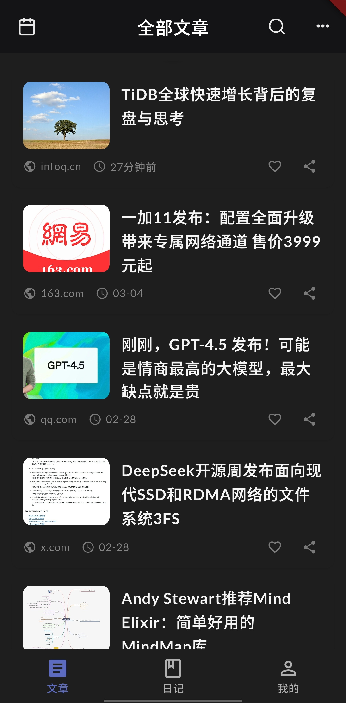

# Daily Satori（日常顿悟）

> 一款本地优先的个人知识管理工具：快速收集网页内容，AI 智能整理，轻松沉淀为个人知识资产。

[](LICENSE)
[](https://flutter.dev/)
[](https://github.com/SatoriTours/Daily/pulls)

## ✨ 核心特性

### 📑 内容收集与管理
- **一键抓取**：智能解析网页，提取标题、正文、首图
- **本地存储**：全文与图片离线缓存，随时可读
- **灵活组织**：标签、收藏、全文搜索
- **广告过滤**：内置 ADBlock，纯净阅读体验

### 🤖 AI 智能增强
- **自动摘要**：快速了解文章核心内容
- **重点提取**：结构化要点，辅助深度学习
- **格式转换**：HTML 一键转 Markdown
- **书籍解读**：输入书名获取信息与核心观点

### 📝 个人沉淀
- **日记记录**：快速记录灵感与思考
- **观点卡片**：保存 AI 生成的观点条目
- **Markdown 阅读**：优化的排版与样式

### 🌐 扩展功能
- **Web 访问**：局域网浏览器访问所有内容
- **备份恢复**：数据导出/导入
- **插件机制**：可扩展的提示词系统
- **自动更新**：应用内检测并升级

## 📸 界面预览

<table>
  <tr>
    <td align="center"><b>文章列表</b></td>
    <td align="center"><b>AI 解读</b></td>
    <td align="center"><b>Markdown</b></td>
    <td align="center"><b>日记</b></td>
  </tr>
  <tr>
    <td></td>
    <td></td>
    <td></td>
    <td></td>
  </tr>
</table>

## 🚀 快速开始

### 环境要求
- Flutter SDK >= 3.0
- Dart SDK >= 2.17
- Android Studio / VS Code

### 安装步骤

```bash
# 1. 克隆仓库
git clone https://github.com/SatoriTours/Daily.git
cd Daily

# 2. 安装依赖
flutter pub get

# 3. 运行应用（建议真机测试）
flutter run
```

### 初始配置
1. 打开应用，进入"设置"页面
2. （可选）填写 AI Key 和 API Base URL
3. 配置 Web 服务端口和密码
4. 开始使用！

> 💡 **提示**：Android 用户请允许应用后台运行，确保 AI 分析任务顺利完成。

## 🏗️ 技术栈

| 类别 | 技术 |
|------|------|
| 框架 | Flutter + GetX (路由/状态管理) |
| 数据库 | ObjectBox (主存储) + SQLite |
| 网络 | Dio + 自定义解析流水线 |
| AI | openai_dart (兼容 OpenAI API) |
| Web 服务 | shelf + WebSocket |
| 其他 | ADBlock 过滤、插件化架构 |

## ⚙️ 配置说明

### AI 设置
- 支持自定义 API Base URL（兼容 OpenAI / 第三方服务）
- 未配置时可作为纯内容管理工具使用

### Web 服务
- 自定义端口和访问密码
- 局域网内浏览器访问所有数据

### 插件扩展
- 自定义提示词模板
- 扩展书籍信息、观点生成等功能
- 参考：[插件示例仓库](https://github.com/SatoriTours/plugin)

## 🗺️ 开发路线

### ✅ 已完成
- [x] 文章抓取与本地缓存
- [x] AI 摘要与重点解读
- [x] Markdown 转换与阅读
- [x] 日记与观点卡片
- [x] Web 访问与备份
- [x] 插件机制
- [x] 自动更新

### 🚧 规划中
- [ ] iOS 与桌面平台支持
- [ ] 多维度高级搜索
- [ ] 知识图谱可视化
- [ ] 学习数据分析面板

## 🤝 参与贡献

我们欢迎各种形式的贡献！

### 贡献方式
- 🐛 报告 Bug
- 💡 提出新功能建议
- 🔧 提交代码改进
- 📝 完善文档
- 🧩 开发新插件

### 开发规范
提交 PR 前请确保：
1. 阅读 [编码规范](./CODING_STANDARDS.md)
2. 遵循 GetX 最佳实践
3. 通过代码检查清单
4. 简述改动意图和影响范围

```bash
# 检查代码规范
flutter analyze

# 格式化代码
flutter format .
```

## ❓ 常见问题

<details>
<summary><b>数据会上传到云端吗？</b></summary>

不会。所有数据都存储在本地，除非你主动配置并调用外部 AI 接口。我们不收集任何用户行为数据。
</details>

<details>
<summary><b>必须配置 AI 功能吗？</b></summary>

不是必须的。未配置时，应用仍可作为纯粹的内容收集和离线阅读工具使用。
</details>

<details>
<summary><b>Web 访问失败怎么办？</b></summary>

请检查：
- 设备是否在同一局域网
- 端口是否被占用
- Android 手机是否关闭了省电限制
</details>

<details>
<summary><b>支持哪些 AI 模型？</b></summary>

支持所有兼容 OpenAI API 的模型和服务，包括 OpenAI、Azure OpenAI、国内第三方服务等。
</details>

## 🔒 隐私声明

- ✅ **本地优先**：数据存储在设备本地
- ✅ **无云端依赖**：不依赖任何云服务
- ✅ **可选 AI**：AI 功能仅在用户配置后启用
- ✅ **零数据收集**：不收集任何用户行为数据

## 📄 开源协议

本项目采用 [MIT License](LICENSE) 开源协议。

## 🔗 相关链接

- 📦 [发行版本](https://github.com/SatoriTours/Daily/releases)
- 🧩 [插件示例](https://github.com/SatoriTours/plugin)
- 🐛 [问题反馈](https://github.com/SatoriTours/Daily/issues)
- 📖 [开发文档](./CLAUDE.md)
- 🎨 [样式指南](./STYLE_GUIDE.md)

## 💬 联系方式

- 提交 Issue：[GitHub Issues](https://github.com/SatoriTours/Daily/issues)
- 讨论交流：[GitHub Discussions](https://github.com/SatoriTours/Daily/discussions)

---

**让信息输入更轻，知识沉淀更快。**

Made with ❤️ by [SatoriTours](https://github.com/SatoriTours)
